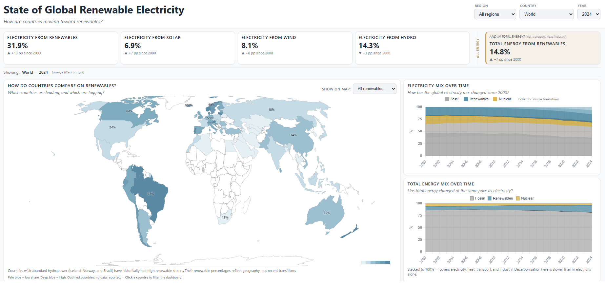
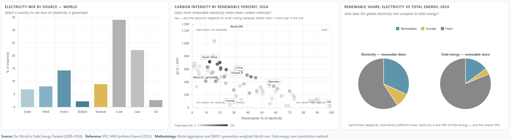

# Global Renewable Electricity Trends Dashboard

*This dashboard is a prototype and currently runs locally. Live hosting is planned in a future iteration.*

## Project Overview

Electricity generated from renewable sources has more than doubled since 2000. The global share of renewable electricity increased from roughly 19% to 32%, driven largely by solar and wind power. However, the pace and mix of adoption vary significantly across countries.

This dashboard uses the *Our World in Data* energy dataset to explore global trends in renewable electricity generation between 2000 and 2024. It compares how countries generate electricity, how renewable adoption has changed over time, and how different replacement pathways relate to carbon intensity. The dashboard also includes a high-level comparison between electricity and total energy use.

The dashboard was built as a standalone HTML application using Claude Code and iterative refinement. The project was created as a prototype for possible redevelopment in Tableau or Power BI.

**Screenshots:**

---

## Questions the Dashboard Answers

1. **How fast is electricity decarbonizing globally?**
   Renewable share of global electricity generation grew from roughly 19% in 2000 to 32% in 2024, with solar and wind providing most of the recent gains.

2. **How does the electricity transition compare to the total energy transition?**
   Electricity is only about 20% of total primary energy (per OWID 2024 data). Sectors such as transport, heating, industry, and agriculture have transitioned more slowly, making them a major challenge for decarbonization.

3. **Within electricity, does the choice of fuel being replaced matter for climate impact?**
   The carbon-intensity view shows how emissions intensity varies across countries and fuel mixes, providing context for interpreting where renewable replacement may have the largest impact. Specific magnitudes depend on lifecycle emissions assumptions and local grid conditions.

4. **How does renewable adoption vary around the world?**
   The dashboard highlights differences in renewable electricity share, generation mix, and carbon intensity across countries.

---

## Approach

The project followed a three-stage workflow: data preparation in Jupyter, dashboard development in Claude Code, and iterative design refinement.

1. **Data Preparation** — Filter, validate, and enrich the OWID dataset; export a dashboard-ready subset (79 countries + World, 2000–2024).

2. **Dashboard Development** — Prototype and build the dashboard as a standalone HTML application using Claude Code.

3. **Design Refinement** — Refine charts, colors, and layout through iterative testing to improve clarity and support the dashboard's core analytical questions.

---
## Results

The final dashboard includes nine visualizations designed to show global renewable electricity trends from multiple perspectives:

* **KPI row** — Key metrics covering renewable electricity share and generation mix.
* **Geographic view** — Choropleth map of renewable share by country.
* **Time-series views** — Electricity and total energy mix trends from 2000–2024.
* **Country detail** — Electricity mix breakdown by selected country.
* **Carbon intensity view** — Renewable share vs carbon intensity across countries.
* **Closing comparison** — Electricity mix compared with total energy mix in 2024.

---
## Limitations

* Limited to 79 countries with complete reporting across the five main metrics (2000–2024).
* Countries with incomplete reporting were excluded.
* 2024 data is approximately 90% complete (199 of 220 countries reporting).
* 2025 data excluded due to incomplete reporting (~40% country coverage).
* Sector-level energy share metrics (`*_share_energy`) are ~64% null and were excluded due to insufficient coverage.
* Renewable energy follows the OWID definition (hydro, solar, wind, biofuels, geothermal/other) and nuclear is shown separately.
* The dashboard compares electricity and total energy but does not break down energy use by sector (transport, heating, industry, agriculture).
* Country rankings are not included.

---

## Next Steps

- Rebuild the dashboard in Tableau or Power BI to reflect the same story in standard business BI tools.
- Source sector-level energy data from IEA or Climate TRACE to directly visualize the hard-to-electrify sectors claim rather than relying on the IPCC reference.
- Explore adding emissions data alongside renewable share to show absolute emissions reductions.

---

## Data

* **Source:** Our World in Data Energy Dataset (OWID)
* **Coverage:** Annual country-level data, 2000–2024
* **Subset:** 79 countries with complete reporting, plus World aggregate (~2,000 records)
* **Key Metrics:** Renewable electricity share, generation mix, total energy share, and electricity carbon intensity
* **License:** CC BY 4.0
* **Reference:** IPCC AR6 Synthesis Report (2023)

---

## Tech Stack

- Python (pandas, numpy)
- Jupyter
- Claude Code
- HTML / JavaScript
- Chart.js
- D3.js

---

## References

- Our World in Data — Energy Dataset. https://github.com/owid/energy-data
- IPCC (2023). AR6 Synthesis Report: Climate Change 2023. Intergovernmental Panel on Climate Change. https://www.ipcc.ch/report/ar6/syr/

**Kristi Flowers**
GitHub: [KRFlowers](https://github.com/KRFlowers)
